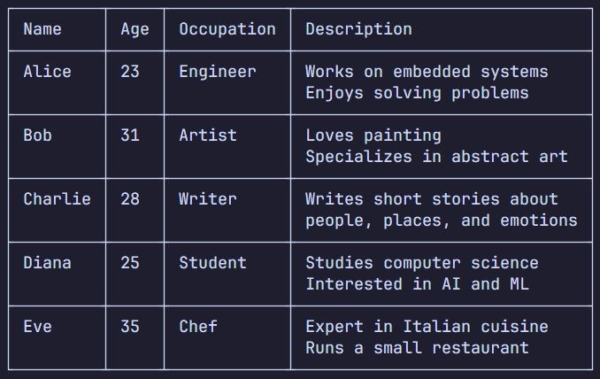

## CSV2TXT
Converts CSV files into nicely formatted text tables with box-drawing borders. You can also configure horizontal and vertical alignment. Supports both CLI usage and importing as a Python module.



## Installation
**Option 1:** Download CLI from the [Releases](https:/github.com/b3hav1/csv2txt/releases) page. Then place the file to any suitable location, adding the directory to your PATH if necessary.

**Option 2:** Download the package files and place them into your Python project. Then run the following command to install the `csv2txt` package locally `uv pip install -e .` or, if you prefer legacy approach: `pip install -e .`.

> **Note:** Unfortunately CLI release is currently available only for Windows but you can run it yourself using `python` and build using `pyinstaller`.

## Usage Example
Run the CSV2TXT executable from the command line:
```ps1
./csv2txt input.csv [options]
```
Options:<br>
`-n` / `--name`    : Optional table title.<br>
`-s` / `--space`   : Spacing between the text and the border.<br>
`-w` / `--width`   : Maximum cells width.<br>
`-a` / `--align`   : Horizontal alignment per cols.<br>
`-t` / `--talign`  : Horizontal alignment for title.<br>
`-v` / `--valign`  : Vertical alignment.<br>
`-o` / `--output`  : Output file path (. for same dir).

## Python Module
You can use `csv2txt` directly in your Python scripts: 
```py
from csv2txt import CSV2TXT, Align, VAlign

# Create an instance with optional settings.
app = CSV2TXT \
(
    # Space between text and borders.
    spacing=1,   

    # Maximum width per cell.   
    max_width=20,   
    
    # Horizontal column alignments.
    align=[Align.LEFT, Align.CENTER, Align.RIGHT]   
)

# Read CSV and generate table.
table = app.read("data.csv", title="Employee Data")

# Print the resulting table.
print(table)
```

## Contributing
Feel free to fork, submit issues, or open pull requests. 
To build from source (Python environment required):

```sh
git clone https://github.com/b3hav1/csv2txt
cd csv2txt
uv pip install -e .
```